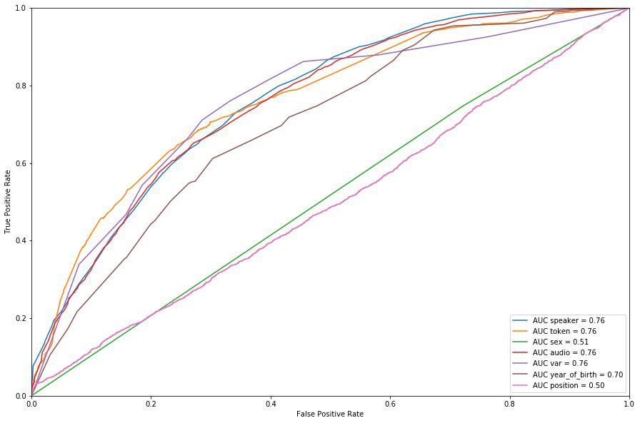

<!-- <style type="text/css"> -->

<!-- body{ /* Normal  */ -->
<!--       font-size: 10px; -->
<!--   } -->
<!-- td {  /* Table  */ -->
<!--   font-size: 8px; -->
<!-- } -->
<!-- h1.title { -->
<!--   font-size: 38px; -->
<!--   color: DarkRed; -->
<!-- } -->
<!-- h1 { /* Header 1 */ -->
<!--   font-size: 28px; -->
<!--   color: DarkBlue; -->
<!-- } -->
<!-- h2 { /* Header 2 */ -->
<!--     font-size: 22px; -->
<!--   color: DarkBlue; -->
<!-- } -->
<!-- h3 { /* Header 3 */ -->
<!--   font-size: 18px; -->
<!--   font-family: "Times New Roman", Times, serif; -->
<!--   color: DarkBlue; -->
<!-- } -->
<!-- code.r{ /* Code block */ -->
<!--     font-size: 8px; -->
<!-- } -->
<!-- pre { /* Code block - determines code spacing between lines */ -->
<!--     font-size: 8px; -->
<!-- } -->
<!-- </style> -->

```{r setup, include=FALSE}
knitr::opts_chunk$set(echo = FALSE)

```

```{r, echo=FALSE, results='hide',  message=FALSE}

assign("last.warning", NULL, envir = baseenv())

Sys.setlocale(,"ru_RU")
library(gridExtra)
library(ggplot2)
library(lme4)

tableau <- read.csv('finall_data_140419.csv')

data <- tableau[tableau$realization_class %in% c('cons', 'inn'),]

data <- na.omit(data)

data$realization_class_bin[data$realization_class == 'inn'] = 0
data$realization_class_bin[data$realization_class == 'cons'] = 1

b <- 1

k <- 1

for (i in unique(data$audio)){
  
  subst <- data[data$audio == i,]
  
  k <- c(k, i)
  
  b <- c(b, max(subst$position))
  
}

info <- data.frame(audio=k, length=b)

data$length <- 0

for (i in unique(data$audio)){
  
  dat <- info[info$audio == i,]
  
  len <- dat$length
  
  data[data$audio == i,]$length <- len
  
}

data$scaled_yb <- scale(data$year_of_birth)

```

## Introduction 

Paradox formulated in @labov1972sociolinguistic: 

> We are then left with the Observers Paradox:  theaim of linguistic research in the community must beto find out how people talk when they are not being systematically observed; yet we can only obtain this data by systematic observation.


## Introduction

**Dialectness** -- probability of occurence of a dialect variable across time

## Data

* Data obtained from Ustja River Basin Corpus (see @rupresch2014 ) -- corpus of dialects of the Russian North
* The corpora was annotated by different people for the  @dobrmd project. All the variables were categorized only as dialect or standart
* Sample of 178 interviews 
* 135 different speakers

## Data 

Used data contains following datafields:

* Speaker -- individual code of the speaker 
* Year of birth -- year of birth of the speaker
* Gender -- gender of the speaker
* Audio --  name of the audio file containing the recording (as the data contains splitted files this field will be useful for gluing the cuted files together)
* Context -- context, in which certain variable was pronounced 
* Token --  the exact token, which contains the variable
* Realization class --  dialectal or standard 
* Variable --  exact variable used
* Position --  position in the interview (in milliseconds)

## Data 

* Interviewer --  the person who has taken the following interview
* Length -- length of the following audio file


## Data 

Year of birth distribution:

```{r years of birth, message=FALSE}
library(ggplot2)

ggplot(data, aes(x=year_of_birth))+
  geom_histogram(binwidth = 2)
```

## Data 

* 14 variables (full list in @dobrmd )

## Data 

* Distribution of variable quantities: 

```{r, echo=FALSE,  results='hide', message=FALSE}
ggplot(data, aes(x=var))+
  geom_histogram(stat='count')+
  xlab('Variable')
```

## Data 

Distribution of lengths: 

```{r, echo=FALSE, message=FALSE}

b_d <- data.frame(b)

b_d$b <- as.difftime(b_d$b/1000, units = 'secs')

ggplot(data=b_d, aes(x=b))+
  scale_x_time()+
  geom_density()+
  xlab('Time (in hrs)')+
  geom_vline(xintercept = mean(b_d$b), color="blue")+
  geom_vline(xintercept = median(b_d$b), color="red")
```

## Data 

Year of birth and realization class corelation (younger people tent to be more dialect):

```{r, echo=FALSE, message=FALSE}
ggplot(data=data, aes(x=year_of_birth, y=realization_class_bin))+
      geom_smooth(method = "glm", method.args = list(family = "binomial"), se=TRUE, colour="red")+
      geom_point()
```

## Hypothesis

**Realization class is influnced by the position, which results in changement in dialectness towards the end of the interview, because speakers get distracted towards the end and start lossing self caution.**


## Preliminary analysis

Causal relations using the PC-algorithm (see @spirtes2000causation, alpha=0.00001):

```{r, echo=FALSE, message=FALSE}

tableau <- read.csv('finall_data_140419.csv')

data <- tableau[tableau$realization_class %in% c('cons', 'inn'),]

data <- na.omit(data)

data$realization_class_bin[data$realization_class == 'inn'] = 0
data$realization_class_bin[data$realization_class == 'cons'] = 1

data$scaled_position <- scale(data$position)

data$scaled_yob <- scale(data$year_of_birth)

data[] <- lapply(data, as.integer)

data <- na.omit(data)

data <- data[c('speaker', 'audio', 'realization_class_bin', 'scaled_position', 'sex', 'scaled_yob', 'var', 'token')]

names <- colnames(data)

suffStat <- list(C = cor(data)
                 , n = nrow(data))


pc.fit <- pcalg::pc(suffStat, indepTest = pcalg::gaussCItest, alpha = 0.00001, labels = names)

pcalg::plot(pc.fit, main = " ")
```

## Analysis 

Generalized linear model with mixed effects. Overall formula: 

* realization_class ~ position + (1 | var) + (1 | sex/speaker) + (1 | year of birth) + (1 | length/audio) + (1 | token) - 1

<!-- ## Analysis -->

<!-- Overall: -->


<!-- ```{r, echo=FALSE} -->

<!-- tableau <- read.csv('finall_data_140419.csv') -->

<!-- data <- tableau[tableau$realization_class %in% c('cons', 'inn'),] -->

<!-- data <- na.omit(data) -->

<!-- data$realization_class_bin[data$realization_class == 'inn'] = 1 -->
<!-- data$realization_class_bin[data$realization_class == 'cons'] = 0 -->

<!-- b <- 1 -->

<!-- k <- 1 -->

<!-- for (i in unique(data$audio)){ -->

<!--   subst <- data[data$audio == i,] -->

<!--   k <- c(k, i) -->

<!--   b <- c(b, max(subst$position)) -->

<!-- } -->

<!-- info <- data.frame(audio=k, length=b) -->

<!-- data$length <- 0 -->

<!-- for (i in unique(data$audio)){ -->

<!--   dat <- info[info$audio == i,] -->

<!--   len <- dat$length -->

<!--   data[data$audio == i,]$length <- len -->

<!-- } -->

<!-- data$scaled_yb <- scale(data$year_of_birth) -->

<!-- lmm <- glmer(realization_class_bin ~ scale(position)+ (1 | sex/speaker) + (1 | var/token) + (1| scaled_yb) + (1 | audio) - 1, data = data, family = binomial("logit")) -->
<!-- summary(lmm)  -->
<!-- ``` -->


## Analysis 

Check different subsets on the singnificance of the position: 

* All variables

-- ae
-- diss
-- etc. 

* Year of birth 

-- < 1940
-- 1940-1960
-- > 1960

* Se... Gender

-- male
-- female

## Analysis

Understand in which subset the position is important. 

Different formulae for different subsets: 

* Variables -- realization_class ~ position +  (1 | sex/speaker) + (1 | year of birth) + (1 | length/audio) + (1 | token) - 1
* Year of birth groups -- realization_class ~ position + (1 | var) + (1 | sex/speaker) + (1 | length/audio) + (1 | token) - 1
* Gender -- realization_class ~ position + (1 | var) + (1 | speaker) + (1 | year of birth) + (1 | length/audio) + (1 | token) - 1

## Analysis 

P-values for each variable: 

| Var | sh                 | adj   | sja1  | sja2              | one  | ei               | diss  | ae                 | tu    | prep_pron       |
|----------|--------------------|-------|-------|-------------------|------|------------------|-------|--------------------|-------|-----------------|
| p-value  | 2.05e-05 (~0.41) | 0.389 | 0.454 | 0.0758 | 0.48 | 0.0965  | 0.256 | <2e-16 (~0.13) | 0.544 | 0.0164 (~0.25) |

sh, ae, prep_pron -- p<0.5, positive slope 

However, ae -- did not converge


## Analysis

SH: 

```{r, echo=FALSE}

tableau <- read.csv('finall_data_140419.csv')

data <- tableau[tableau$realization_class %in% c('cons', 'inn'),]

data <- na.omit(data)

data$realization_class_bin[data$realization_class == 'inn'] = 0
data$realization_class_bin[data$realization_class == 'cons'] = 1

ggplot(data = data[data$var == 'sh',], aes(y=realization_class_bin, x=position))+
    geom_smooth(method = "glm", method.args = list(family = "binomial"), se=TRUE, colour="red", formula = y ~ x - 1)+
    ylim(0, 1)+
    xlab('Position (in ms)')+
    ylab('Realization class')
```

## Analysis

AE: 

```{r, echo=FALSE, message=FALSE}
tableau <- read.csv('finall_data_140419.csv')

data <- tableau[tableau$realization_class %in% c('cons', 'inn'),]

data <- na.omit(data)

data$realization_class_bin[data$realization_class == 'inn'] = 0
data$realization_class_bin[data$realization_class == 'cons'] = 1

ggplot(data = data[data$var == 'ae',], aes(y=realization_class_bin, x=position))+
    geom_smooth(method = "glm", method.args = list(family = "binomial"), se=TRUE, colour="red", formula = y ~ x - 1)+
    ylim(0, 1)+
    xlab('Position (in ms)')+
    ylab('Realization class')
```

## Analysis

AE (all the files): 

```{r, echo=FALSE, message=FALSE, warning=FALSE}
tableau <- read.csv('finall_data_140419.csv')

data <- tableau[tableau$realization_class %in% c('cons', 'inn'),]

data <- na.omit(data)

data$realization_class_bin[data$realization_class == 'inn'] = 0
data$realization_class_bin[data$realization_class == 'cons'] = 1

ggplot(data = data[data$var == 'ae',], aes(y=realization_class_bin, x=position))+
    geom_smooth(method = "glm", method.args = list(family = "binomial"), se=TRUE, colour="red", formula = y ~ x - 1)+
    ylim(0, 1)+
    xlab('Position (in ms)')+
    ylab('Realization class')+
    facet_wrap(~ audio)
```


## Analysis

PREP_PRON

```{r, echo=FALSE}
tableau <- read.csv('finall_data_140419.csv')

data <- tableau[tableau$realization_class %in% c('cons', 'inn'),]

data <- na.omit(data)

data$realization_class_bin[data$realization_class == 'inn'] = 0
data$realization_class_bin[data$realization_class == 'cons'] = 1

ggplot(data = data[data$var == 'prep_pron',], aes(y=realization_class_bin, x=position))+
    geom_smooth(method = "glm", method.args = list(family = "binomial"), se=TRUE, colour="red", formula = y ~ x - 1)+
    ylim(0, 1)+
    xlab('Position (in ms)')+
    ylab('Realization class')
```


## Analysis 

Age group: 

| Group   | < 1940 | 1940-1960        | > 1960 |
|---------|--------|------------------|--------|
| p-value | 0.302  | 0.0246 (0.08280) | 0.437  |

1940-1960 -- p<0.5, positive slope


## Analysis

1940-1960

```{r, echo=FALSE}
tableau <- read.csv('finall_data_140419.csv')

data <- tableau[tableau$realization_class %in% c('cons', 'inn'),]

data <- na.omit(data)

data$realization_class_bin[data$realization_class == 'inn'] = 0
data$realization_class_bin[data$realization_class == 'cons'] = 1

ggplot(data = data[data$year_of_birth > 1940 & data$year_of_birth < 1960,], aes(y=realization_class_bin, x=position))+
    geom_smooth(method = "glm", method.args = list(family = "binomial"), se=TRUE, colour="red", formula = y ~ x - 1)+
    ylim(0, 1)+
    xlab('Position (in ms)')+
    ylab('Realization class')
```

## Analysis 

Gender: 

| Group   | male              | female |
|---------|-------------------|--------|
| p-value | 0.00579 (0.15378) | 0.788  |

male -- p<0.5, positive slope

## Analysis

Male:

```{r, echo=FALSE}
tableau <- read.csv('finall_data_140419.csv')

data <- tableau[tableau$realization_class %in% c('cons', 'inn'),]

data <- na.omit(data)

data$realization_class_bin[data$realization_class == 'inn'] = 0
data$realization_class_bin[data$realization_class == 'cons'] = 1

ggplot(data[data$sex == 'male',], aes(y=realization_class_bin, x=position))+
    geom_smooth(method = "glm", method.args = list(family = "binomial"), se=TRUE, colour="red", formula = y ~ x - 1)+
    ylim(0, 1)+
    xlab('Position (in ms)')+
    ylab('Realization class')
```

## Preliminary summary 

* There is no significance on the "global" level
* If there is a trend in the subsets, it is usually positive (from less dialect in the beggining to more in the end). **But**, ae and 1940-1960 -- negative
* This can may be be linked with the fact that the speakers are getting more concentrated after some time and they start to use only the dialect variants

## If not position, then what? 

LogisticRegressionCV from sklearn Python-package (cv=10, max_iter=1000)

Metric: roc-auc score

```{r, out.width = "600px"}

```

## If not position, then what? 

| category | speaker | token | sex   | audio | var   | year of birth | position |
|----------|---------|-------|-------|-------|-------|---------------|----------|
| roc      | 0.765   | 0.767 | 0.513 | 0.760 | 0.758 | 0.704         | 0.498    |

\\


token > speaker > audio > variable > year of birth > sex > position

## Litterature